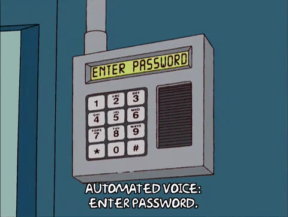

# Passwörter: Aufgaben

## Aufgabe 1

### Starkes Passwort erstellen

Ändere das Passwort für die Windows-Ameldung in deiner VM. Erstelle dazu ein sogenannt _starkes_ Passwort.

Notiere das Passwort in deiner Dokumentation und erkläre kurz, auf was du bei der Erstellung des starken Passwortes geachtet hast.

## Aufgabe 2

### Passwort-Manager einrichten

Installiere einen Passwort-Manager deiner Wahl in deiner VM und nehme ihn gleich in Betrieb, indem du das neue Passwort für die Windows-Anmeldung (Aufgabe 1) dort ablegst.

### Dokumentation ergänzen

Ergänze deine Dokumentation mit einem Bildschirmprint des von dir installierten Passwort-Managers. Notiere das Master-Passwort und erkläre schriftlich (mindestens zwei Gründe), weshalb du gerade diesen Passwort-Manager ausgewählt hast.

## Aufgabe 3

### Zwei-Faktor-Authentisierung

Recherchiere im Internet, was mit "Zwei-Faktor-Authentisierung (2FA), oft auch als Zwei-Faktor-Authentifizierung bezeichnet, gemeint ist.

Beschreibe dann in deiner Dokumentation mit *eigenen Worten*, was genau "Zwei-Faktor-Authentisierung" ist und wie sie funktioniert. Und: Wo in deinem Alltag verwendest du bereits 2FA?
