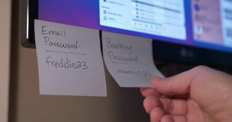

# Passwörter

 Immer wieder gelingt es Hackern, persönliche Accounts zu knacken und auf Kosten der betroffenen Personen online einzukaufen oder private Fotos und Dokumente zu entwenden. Meist liegt das  daran, dass die Passwörter zu einfach sind. Wie die dümmsten Passwörter der Welt lauten und wie du dich vor Datenklau schützen kannst, erfährst du in diesem Kapitel.

## Die 20 blödesten Passwörter

Das weltweit am meisten verbreitete Passwort ist auch heute - im Jahr [2018](https://www.teamsid.com/100-worst-passwords-top-50/) - noch immer "123456". Dieses Passwort ist in Sekunden zu knacken. Falls du zu den ganz Schlauen gehörst und einfach "password" als Passwort verwendest, dann sei gewarnt: diese vermeintlich clevere und simple Lösung liegt auf Rang zwei der meistgeknackten Passwörter.

Schau dir dazu das folgende Video an. Auch wenn der Titel des Videos nicht so vielversprechend klingt, werden in diesen 2:30 Minuten doch einige interessante Sachen angesprochen. 

- Video: [Die 20 blödesten Passwörter](res/die-20-bloedesten-Passwoerter.mp4)

## Warum du ein starkes Passwort benutzen solltest

Passwörter wie "Hund", "Sommer", "Montag" oder „Schatz“ wären beim ersten [Wörterbuchangriff](https://de.wikipedia.org/wiki/W%C3%B6rterbuchangriff) leicht geknackt. Wenn du ein solch schwaches Passwort verwendest, hattest du bloss Glück, wenn es noch niemand herausgefunden hat. Aber warte mal: vielleicht liest ja bereits dein Chef oder dein/e Ex-Freund/in deine privaten E-Mails oder die Nachrichten in deinem Facebook Account? 

### Ein starkes Passwort erstellen

Wenn du deine Daten schützen willst, benötigst du starke Passwörter, die mindestens 10 Zeichen lang sind und Zahlen, Gross- und Kleinbuchstaben sowie Sonderzeichen beinhalten. Aber wie merkt man sich eine lange und komplexe Zeichenfolge? Das folgende Video zeigt einen praktischen Trick, wie starke Passwörter erstellt werden können.  

- Video: [How to create a strong password](how-to-create-a-strong-password.mp4)

### Passwortcheck 

Möchtest du wissen, ob ein Passwort wirklich sicher ist? Auf [www.passwortcheck.ch](https://www.passwortcheck.ch/) kannst du das überprüfen. 

## E-Mail-Postfach besonders schützen

Wer mal ein Passwort vergessen hat, kann sich meistens per E-Mail ein neues zusenden lassen. Wenn der Zugang zum Postfach geknackt wird, können Betrüger besonders  einfach ihre Passwörter für Ebay oder das Online-Banking ändern. Der E-Mail-Account sollte daher besonders geschützt werden! 

## Weitere Tipps

Wie in vielen anderen Lebensbereichen kann man auch beim Schutz der eigenen Daten mit gesundem Menschenverstand und brain.exe schon sehr weit kommen. Ein paar Tipps: 

-  Verwende niemals persönliche Informationen (Namen, Geburtstage, Adressen) für dein Passwort. 
- Ändere dein Passwort regelmässig.
- Verrate niemals dein Passwort.
- Verwende jedes Passwort nur einmal, egal ob für deinen Laptop, Online-Spiel, Social Media, WebShop usw.
- Verwende wenn möglich nicht die "Passwort merken"-Funktion im Browser oder in mobilen Apps. 
- Speichere oder notiere Dir deine Passwörter niemals im Klartext, z.B. auf einem Post-It, einem Notizbuch. einem Word-Dokument oder einer Text-Datei.

## Einen Passwort-Manager nutzen

Langsam beginnen dich Passwörter zu nerven? Du fragst dich, wie du  dir all die langen, komplizierten, einzigartigen und schwer zu erratenden Passwörter merken sollst? Dann könnte eine Passwort-Manager Software die Lösung sein für dich. Schau dir doch mal das folgende Video vom [Passwort-Manager Test 2019 von CHIP](https://www.chip.de/test/Die-besten-Passwort-Manager-2019_128580641.html) an.

- Video: [Passwort-Manager Test](res/passwort-manager-test-chip-2019.mp4)

Du siehst: die Passwort-Sicherheit lässt sich mit einem Passwort-Manager gezielt steigern. Hier als Empfehlung drei Passwort-Manager, die beim CHIP-Test gut abgeschnitten haben. 

- [Keepass](https://keepass.info/) 
- [LastPass](https://www.lastpass.com/de)
- [1Password](https://1password.com/de/) (kostenpflichtig)

 ### Dienst oder lokale Software

 Passwort-Manager gibt es in zwei Ausprägungen: 
 
 1. als Online-Dienst 
 2. als lokale Software 
 
 Der Unterschied steckt im Sicherheitskonzept. Bei den Diensten (LastPass, 1Password) wird die Datenbank mit den verschlüsselten Passwörtern auf dem Server des Anbieters gespeichert. Das heisst, es bleibt ein Restrisiko; denn die Server der Passwortdienste könnten gehackt werden oder ein Mitarbeiter manipuliert Daten. 
 
 Bei den lokalen Passwortmanagern, zu denen das kostenlose KeePass zählt, liegt die Datenbank mit den veschlüsselten Passwörtern nur lokal vor und so hast du die komplette Kontrolle darüber. Der Nachteil ist, dass du mehr Aufwand hast, um mehrere Geräte auf dem gleichen Stand zu halten.
 

_Abbildung: Passwortaufbewahrung, wie man es nicht machen sollte..._

## Wusstest du schon, dass... 

... **81%** aller Datenpannen auf gestohlene oder schwache Passwörter zurückzuführen sind?

... ein Programm **2 Minuten** braucht, um ein 5-stelliges Passwort aus Kleinbuchstaben zu knacken. 

... es ca. **984 Jahre** dauert, bis ein Programm ein 10-stelliges Passwort mit Zahlen, Gross- u. Kleinbuchstaben sowie Sonderzeichen geknackt hat?

... kriminelle Hacker ein gefundenes Passwort **auf allen möglichen Accounts** ausprobieren, die sie zu einer Person finden?

... kriminelle Hacker immer zuerst die vom Hersteller voreingestellten **Standardpasswörter** (Admin, root,...) ausprobieren, wenn sie auf Geräte (z.B. Laptop, Handy, Router) zugreifen wollen? 

... der 1. Donnerstag im Mai der **Welt-Passworttag** ist? An diesem Tag wird daran erinnert, starke Passwörter und, wenn möglich, Zwei-Faktor-Authentifizierung zu benutzen.