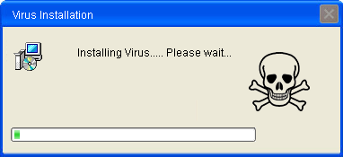

# Malware: Aufgaben

## Aufgabe 1

### Viren, Würmer, Trojaner, Hoax - was ist der Unterschied? 

Bereite eine Präsentation vor, um deinen Kollegen und deinem Berufsbildner folgende Malware zu erklären: 

- Was ist ein Computervirus? 
- Was ist ein Wurm? 
- Was ist ein Trojaner? 
- Was ist Ransomware?
- Was ist ein Hoax 

Erkläre auch die jeweilige Funktionsweise (Prinzip genügt) sowie welche Schutzmassnahmen und Gegenmassnahmen getroffen werden
können respektive getroffen werden sollten (mache eine Empfehlung!), um Schaden zu
vermeiden.

**Termin abmachen:** Mache mit deinem Berufsbildner einen Termin für die Präsentation ab.

[comment]:https://www.pcwelt.de/ratgeber/So-kommen-Viren-und-Wuermer-auf-den-PC-5757291.html

## Aufgabe 2

### Virenscanner

1. Informiere dich im Web über Virenscanner (Funktionsweise, Typen, Kritik) und fasse die Resultate in deiner Dokumentation zusammen.
2. Suche im Internet nach Antivirenprogrammen, vergleiche sie (Eigenschaften? Preis? Testberichte?) und installiere eines davon in deiner VM. Begründe deine Wahl schriftlich in deiner Dokumentation. 

## Zusatzaufgabe     

In vielen Foren wird es nicht empfohlen mehrere Virenscanner gleichzeitig am Laufen zu haben. Wieso ist dies der Fall? 

