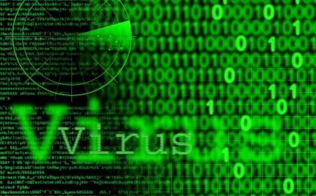

# Malware

Als Schadprogramm respektive Malware bezeichnet man Computerprogramme, die unerwünschte und/oder schädliche Funktionen ausführen. Malware ist damit ein Sammelbegriff für Programme, die speziell dazu entwickelt wurden, deinem Computer oder deinen Daten Schaden zuzufügen. Es gibt zahlreiche Unterarten von Malware - zum Beispiel:

- Viren
- Trojaner
- Würmer
- Spyware

Jede Unterart funktioniet unterschiedlich, alle haben jedoch das gleiche Ziel: Dir zu schaden!

In privaten Haushalten und kleinen Unternehmen gehören Angriffe durch Viren, Würmer und Trojaner zu den häufigsten Ursachen für Datenverluste. Deshalb sind konsequent durchgeführte Sicherheitsupdates sehr wichtig!

## Wie ein Virus auf einen PC gelangt

[comment]:https://www.tecchannel.de/a/computerviren-grundlagen,401215,3

Viren kommen getarnt in einem Programm oder in einem Makro-fähigen Dokument (z.B. Word-Datei) daher. Solche gefährliche Dateien können von irgendwoher stammen, z.B. von einem USB-Stick, einer CD oder als Download aus dem Internet. Sobald du das virenverseuchte Programm/Dokument startest respektive öffnest, wird der Virus aktiv. Er nistet sich dann so auf deinem Rechner in, dass er bei jedem PC-Start automatisch aktiv wird.

Entscheidend für die Virenabwehr ist es deshalb, das Einnisten des Virus im System zu verhindern. Solange der Virus nicht gestartet ist, kann er auch keinen Schaden anrichten.

## Wie du dich schützen kannst

Du kannst Hackern leicht einen Strich durch die Rechnung machen, indem du die folgenden drei einfachen Regeln beachtest:

1. Lade keine Software aus dubiosen Quellen herunter. Vertraue nur auf Download-Angebote von seriösen Firmen und die von vielen genutzt werden.
2. Öffne keine Anhänge in E-Mails von unbekannten Personen (du solltest aber auch bei bekannten Personen misstrauisch sein, denn deren Rechner könnte verseucht sein, und: bei angehängten EXE-Dateien ist in jedem Fall Vorsicht geboten!)
3. Halte dein Betriebssystem und die auf deinem PC installierte Software stets aktuell (vergiss auch nicht, die Browser Plugins regelmässig zu aktualisieren, insbesondere Java und Flash sind häufig Ziel von Angriffen).

### Virenscanner

> Ein Antivirenprogramm (auch Virenscanner oder Virenschutz genannt) ist eine Software, die bekannte Computerviren, Computerwürmer und Trojanische Pferde aufspürt, blockiert und gegebenenfalls beseitigt.

Quelle: [computerlexikon.com](https://www.computerlexikon.com/was-ist-virenscanner)

Antivirenprogramme sind auch heute noch unverzichtbar, da sie bekannte Malware aller Art erkennen und filtern und du solltest deshalb auf deinem  Rechner auf jeden Fall einen  Virenscanner installieren.

Für Unternehmen ist heutzutage [Ransomware](https://de.wikipedia.org/wiki/Ransomware) eine der grössten Bedrohungen. Gegen diese Bedrohung helfen Antivirenprogramme leider nicht. Deshalb sollte ein Unternehmen sich nicht alleine auf eine Antivirensoftware verlassen, sondern sich zusätzlich mit tiefergehenden Sicherheitslösungen schützen.  

Dazu ein vertiefender Artikel in der Computerwoche:
[Warum Unternehmen weiter Antiviren-Software brauchen](https://www.computerwoche.de/a/warum-unternehmen-weiter-antiviren-software-brauchen,3544856)
