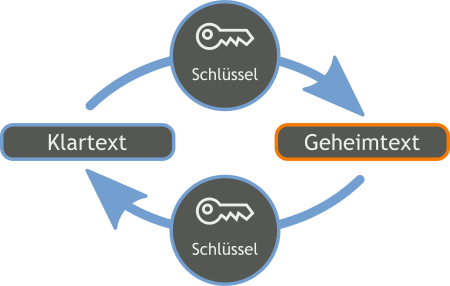
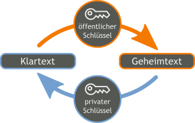

# Verschlüsselung

Aufgrund einer amerikanischen Behörde, zu welcher fast wöchentlich neue Informationen an die Öffentlichkeit gelangen, kann es sein, dass einige Bereiche dieses Themas nicht mehr ganz aktuell sind. Es ist fast unmöglich hier immer am Ball zu bleiben. Wenn wir es neutral anschauen, unterstreichen diese Vorkommnisse allerdings nur die Wichtigkeit dieses Themas.

## Symmetrische Verschlüsselung

Ein symmetrisches Kryptosystem ist ein Kryptosystem, bei welchem im Gegensatz zu einem asymmetrischen Kryptosystem beide Teilnehmer denselben Schlüssel verwenden.

Der grosse Nachteil symmetrischer Verfahren liegt in der Nutzung ein- und desselben Schlüssels zur Ver- und Entschlüsselung, d. h. neben der verschlüsselten Information muss auch der Schlüssel übermittelt werden. Das Problem beim Einsatz symmetrischer Verfahren ist, dass der Schlüssel über einen sicheren Kanal übertragen werden muss, da die Sicherheit von der Geheimhaltung des Schlüssels abhängt.

### Beispiel: Die Caesar-Verschlüsselung

Die Caesar-Verschlüsselung ist die älteste und wahrscheinlich berühmteste symmetrische Verschlüsselung. Sie geht auf den römischen Feldherrn Julius Caesar zurück, der diese Art der geheimen Kommunikation für seine militärische Korrespondenz verwendet hat. Die Caesar-Verschlüsselung bietet sich als Demonstrationsverschlüsselung an, da mit ihr leicht die Grundlagen der Kryptographie erklärt werden können.

#### Funktionsweise

Bei der Caesar-Verschlüsselung wird jeder Buchstaben durch einen neuen Buchstaben ersetzt, nämlich der Buchstabe, der im Alphabet um drei Stellen versetzt ist. D.h. aus einem "A" wird durch eine Verschiebung um drei Zeichen der Buchstabe "D", aus "B" wird ein "E", aus "C" ein "F" usw. Damit ergibt sich am Ende folgende "Umwandlungstabelle": 

Möchte man nun z.B. das Wort "kryptowissen" verschlüsseln, muss man lediglich oben in der Tabelle nach jedem Buchstaben schauen und die Buchstaben mit dem darunterstehenden ersetzen. So ist "kryptowissen" verschlüsselt gleich: "nubswrzlvvhq".

Wenn du die Caesar-Verschlüsselung testen möchtest, kannst das online hier tun: [Online-Tool Caesar-Verschlüsselung](https://www.kryptowissen.de/caesar-chiffre-praxis.php).

#### Achtung

8-ung: Die Caesar-Verschlüsselung ist alles andere als sicher. Sie kann leicht "geknackt" werden. Bei einem hinreichend langen Text kann man nämlich per Häufigkeitsanalyse auf die Verschiebung schliessen. Und selbst falls dies nicht gelingt, bietet immer noch der kleine Schlüsselraum von lediglich 25 eine Angriffsmöglichkeit, bei der man immer auf den richtigen Schlüssel gelangt. Man probiert einfach alle mögliche Verschiebungen aus und hat spätestens nach dem 25. Versuch den Klartext.

## Asymmetrische Verschlüsselung

Beim asymmetrischen Verschlüsselungsverfahren (auch Public-Key-Verfahren genannt), gibt es im Gegensatz zum symmetrischen Verfahren, nicht nur einen Schlüssel, sondern zwei. Dieses Schlüsselpaar setzt sich zusammen aus einem geheimen privaten Schlüssel (Private Key) und einem öffentlichen Schlüssel (Public Key), der nicht geheim ist, zusammen.

Im Vergleich zu symmetrischen Verschlüsselungsverfahren, sind asymmetrische Verfahren relativ jung. Existierten schon zur Zeit des grossen Cäsars symmetrische Verfahren, entstand mit RSA erst im Jahre 1977 das erste asymmetrische Kryptosystem. 

### Prinzip

Um das Prinzip der asymmetrischen Verschlüsselung zuverstehen zu können, muss man immer im Hinterkopf behalten, dass man es nicht nur mit einem Schlüssel zu tun hat, sondern mit zwei. Der private Schlüssel muss dabei geheim gehalten werden und es muss praktisch unmöglich sein, ihn aus dem öffentlichen Schlüssel zu berechnen. Der öffentliche Schlüssel hingegen muss jedem zugänglich sein, der eine verschlüsselte Nachricht an den Besitzer des privaten Schlüssels senden will.

Das Ganze beginnt mit der Veröffentlichung des, wie der Name es schon sagt, öffentlichen Schlüssels. Die Veröffentlichung kann z.B. über einen Server erfolgen, oder aber auch per Mail. Man muss ihn nicht auf einem sicheren Weg übertragen, jeder darf in den Besitz des öffentlichen Schlüssels gelangen. Oft ist es sogar erwünscht, dass sich der öffentliche Schlüssel global verteilt, um so sicherzustellen, dass kein anderer öffentlicher Schlüssel unter falschen Namen Verbreitung findet. Mit dem öffentlichen Schlüssel kann nun jeder eine Nachricht für den Besitzer des öffentlichen Schlüssels verschlüsseln. Die verschlüsselte Nachricht kann so nur noch vom Empfänger mit seinem geheimen privaten Schlüssel entschlüsselt werden.

### Anwendung

Asymmetrische Kryptosysteme werden eingesetzt bei Verschlüsselungen, Authentifizierungen und der Sicherung der Integrität. Bekannte Beispiele sind:

- OpenPGP
- SSH
- SSL/TLS
- https

Weiter finden asymmetrische Veschlüsselungsverfahren Anwendung bei digitalen Signaturen.

## VeraCrypt

VeraCrypt ist aus dem Verschlüsselungsprogramm TrueCrypt hervorgegangen und gehört zu den beliebtesten Open-Source-Programmen. Mit VeraCrypt können verschlüsselte Container erstellt sowie Festplatte, SSD, USB-Sticks und SD-Karten verschlüsselt werden.

### Alternative zu Bitlocker

Unter Windows bietet VeraCrypt zudem als Open-Source-Alternative zu Bitlocker an, der Verschlüsselungssoftware von Microsoft. Denn angesichts der Informationen, die durch den Whistleblower Edward Snowden bekannt wurden, ist davon auszugehen, dass Bitlocker eine Hintertür enthält durch die Geheimdienste die Bitlocker-Verschlüsselung umgehen können.

## E-Mails lassen sich leicht mitlesen

E-Mails lassen sich leicht mitlesen weil sie unverschlüsselt über das Internet verschickt werden. Und spätestens seit den Enthüllungen von [Edward Snowden](https://de.wikipedia.org/wiki/Edward_Snowden) wissen wir, dass gewisse staatliche Stellen massenhaft Daten abfangen. Wer sich nicht schützt, muss sich also nicht wundern, wenn Mails mit Geschäfts- oder anderen Geheimnissen mitgelesen werden.

Prinzipiell lässt sich mit einem geeigneten E-Mail-Client jeder Maildienst verschlüsselt betreiben. So kann man mit den Einstellungen des E-Mail-Clients zunächst einmal sicherstellen, dass der Transportweg der Mail zum Provider verschlüsselt wird. Die Einstellung "verschlüsselte Verbindung" sollte für alle Server aktiviert sein. Damit sind aber leider nicht die Inhalte selbst gesichert. Auf dem Server des Providers können sie immer noch mitgelesen werden. Wirkliche Sicherheit erhält man nur durch Ende-zu-Ende-Verschlüsselung mit [S/MIME](https://de.wikipedia.org/wiki/S/MIME) oder [PGP](https://de.wikipedia.org/wiki/Pretty_Good_Privacy).
